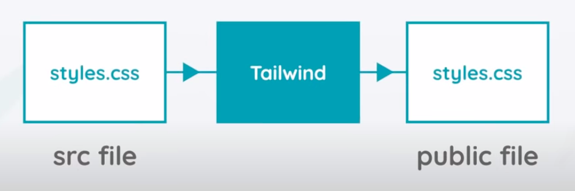

This repository is for tracking the learning curve of tailwindCSS. Here I will design my CV as a 2nd training project of DSi.

Few Learning links I used:
- [Net Ninja playlist](https://www.youtube.com/watch?v=bxmDnn7lrnk&list=PL4cUxeGkcC9gpXORlEHjc5bgnIi5HEGhw)
- [Official website](https://tailwindcss.com/)

## Introductory Steps
---

### What is Tailwind CSS
- A CSS framework made up of utility classes. 
- Much lower-level than Bootstrap, Materialize etc.
- We combine different lower level utility classes to design a component. For example if we want to design a card in `Tailwind` we need to combine `rounded`, `shadow`, `p-2`, `bg-white` classes. So our code will be `class="rounded shadow p-2 bg-white"`.
This doesn't mean we have to do more work than bootstrap btw. 

### How we can use Tailwind CSS in our project
Install Tailwind using **n**ode **p**ackage **m**anager. So we will ned node.js installed in our computer.\
Steps:
1. install node.js v12+.
    ```
    sudo apt update
    curl -sL https://deb.nodesource.com/setup_14.x | sudo bash -
    sudo apt -y install nodejs
    node  -v
    ```
2. install npm
3. Go to inside project folder, create a new *package.json* file using `npm init -y`. We need this to track our installed dependencies.
4. Install `tailwind`, `postcss`, `autoprefixer` dependencies using `npm install -D tailwindcss@latest postcss@latest autoprefixer@latest`

### How Tailwind works


We create a src folder where all of our src files will be there and write all of our code there incluing styles.css if needed. Another folder named public where our output css gonna go after tailwind has processed it. Public folder also contains html and js files. Public folder will evnetually deployed to webhost on the Internet.

## Start building
---

### Include Tailwind in your CSS
1. Create a CSS file if you don't already have one, and use the @tailwind directive to inject Tailwind's `base`, `components`, and `utilities` styles:
```
@tailwind base;
@tailwind components;
@tailwind utilities;
```
2. In your scripts inside package.json remove existings and put `"build-css": "npx tailwindcss-cli@latest build ./src/styles.css -o ./public/styles.css"`
3. Run `npm run build-css` which will build tailwind necessary utility classes.

Any changes made inside src/styles.css will be updated public/styles.css. 

### Start Live server and viewing HTML output

Installing live server globally and live the public folder only.
```
sudo npm install live-server -g
live-server public
```
Without any CSS we are viewing default browser styles. So to link `public/styles.css` we will use `link` tag inside `public/index.html`. After adding css our whole design becomes same as we didn't define any utility class so far.

## tailwind-config file
We can extend a property or overwrite the default one.
- To create: `npx tailwind@latest init` or full version with default values `npx tailwind@latest init -full`.
- Everytime when we made changes we need to rebuild the css using `npm run build-css`.

## responsiveness in tailwind
Tailwind is a mobile-first approach. It starts with the smallest possible device. 

## @apply
If we have same classes which need to write again and again we can use our custom class and apply the directives.
```
.<custom name> {
    @apply <all the classes here>;
}
```
Then instead of writing all the classes, just use `<custom name>`.

## pseudo elements in tailwind
So far, tailwind didn't cover pseudo elements like `::before` and `::after`. [Issues opend in Tailwind Github Repo](https://github.com/tailwindlabs/tailwindcss/discussions/2119). But there are few plugins by which we can use them [Link1](https://openbase.com/js/tailwindcss-pseudo/documentation), [Link2](https://github.com/croutonn/tailwindcss-pseudo-elements).
- Install plugin:
```
npm i tailwindcss-pseudo 
npm install tailwindcss-pseudo-elements --save-dev
```